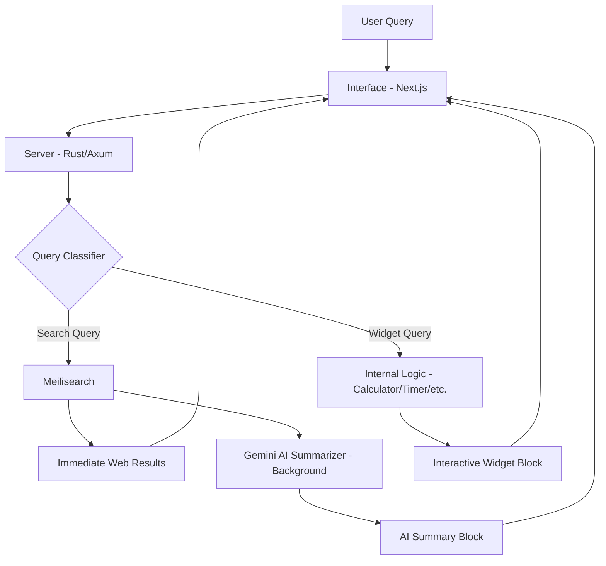

# Notice

A sophisticated, AI-powered search engine that decouples traditional web search from intelligent AI analysis. **Notice** provides immediate web results followed by insightful, background-generated AI summaries, along with interactive widgets for a seamless information retrieval experience.


## 🛠 Technology Stack

| Hierarchy | Technology | Role |
| :--- | :--- | :--- |
| **Backend** | `Rust` / `Axum` | High-performance API server and core logic coordinator. |
| **Search Engine** | `Meilisearch` | Lightning-fast full-text search and indexing server. |
| **AI Engine** | `Google Gemini API` | Advanced LLM for content classification, summarization, and interactive tasks. |
| **Frontend** | `Next.js` / `React` | Modern, responsive interface with server-side rendering. |
| **Styling** | `Tailwind CSS 4` | Utility-first CSS for premium, high-performance UI design. |
| **Animations** | `Motion` | Smooth, interactive micro-animations for an enhanced UX. |
| **State Mgmt** | `Zustand` | Lightweight, reactive state management for the frontend. |

## ✨ Key Features

- **Decoupled Search**: Instant web results from Meilisearch with background AI processing for deep summaries.
- **AI Content Classification**: Automatically identifies and categorizes search results using Gemini.
- **Interactive Widgets**: Built-in support for calculators, currency converters, and timers powered by the backend.
- **Smart Spell-check**: SymSpell-based query correction to ensure accurate search results.
- **Rich UI Blocks**: Modular UI components for displaying universal, semantic, and specialized data.

## 🏗 Architecture

The following diagram illustrates the flow from user input to the final intelligent response:



---

## 🚀 Getting Started

### Prerequisites
- [Rust](https://www.rust-lang.org/tools/install)
- [Bun](https://bun.sh/) or [Node.js](https://nodejs.org/)
- [Meilisearch](https://www.meilisearch.com/docs/learn/getting_started/installation)

### Installation
1.  **Clone the repository**:
    ```bash
    git clone https://github.com/nathezek/notice.git
    cd notice
    ```

2.  **Start the Backend**:
    ```bash
    cd server
    cargo run
    ```

3.  **Start the Interface**:
    ```bash
    cd interface
    bun install
    bun run dev
    ```
