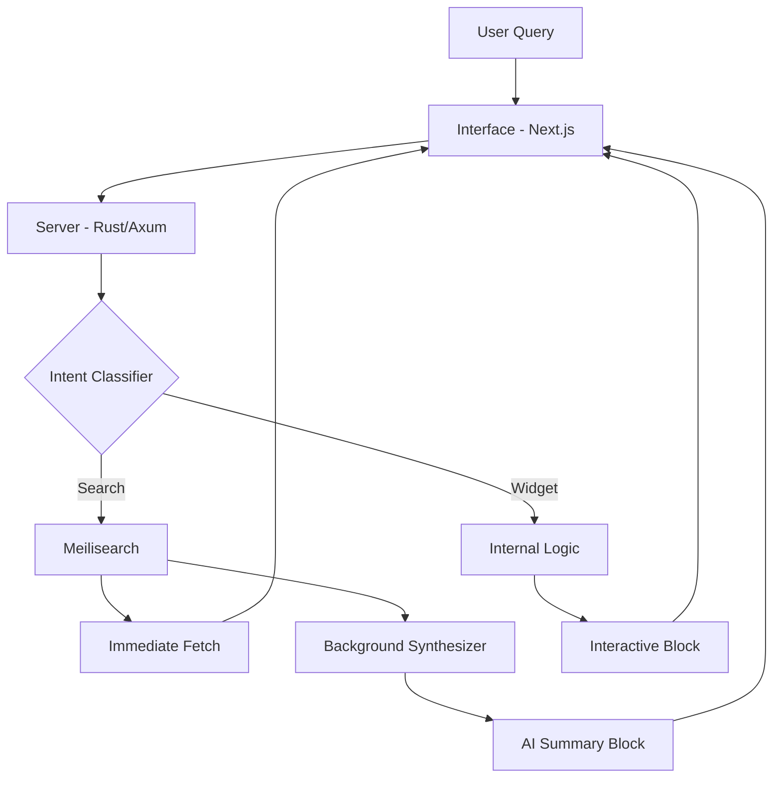

# Notice

An intent-driven research engine built for developers who value speed over noise. **Notice** bridges the gap between raw indexing and intelligent synthesis, providing an interface that prioritizes immediate data retrieval while orchestrating sophisticated background analysis. 


## 🛠 Technology Stack

| Hierarchy | Technology | Role |
| :--- | :--- | :--- |
| **Backend** | `Rust` / `Axum` | High-performance API server and core logic coordinator. |
| **Search Engine** | `Meilisearch` | Lightning-fast full-text search and indexing server. |
| **AI Engine** | `Google Gemini API` | Advanced LLM for content classification and synthesis. |
| **Frontend** | `Next.js` / `React` | Modern, responsive interface with server-side rendering. |
| **Styling** | `Tailwind CSS 4` | Utility-first CSS for premium, high-performance UI design. |
| **Animations** | `Motion` | Smooth, interactive micro-animations for an enhanced UX. |
| **State Mgmt** | `Zustand` | Lightweight, reactive state management for the frontend. |

## ✨ Key Features

- `Decoupled Execution`: Instant web results from Meilisearch with background processing for deep analysis.
- `Content Classification`: Automatically identifies and categorizes query intent using LLM inference.
- `Native Widgets`: Integrated support for calculators, currency converters, and timers baked into the core logic.
- `SymSpell Correction`: High-performance query correction to ensure accuracy under heavy load.
- `Modular UI`: Flexible component architecture for specialized data visualization.

## 🏗 Architecture

The flow from intent recognition to synthesized response:



## 🚀 Getting Started

### Prerequisites
- [Rust](https://www.rust-lang.org/tools/install)
- [Bun](https://bun.sh/) or [Node.js](https://nodejs.org/)
- [Meilisearch](https://www.meilisearch.com/docs/learn/getting_started/installation)

### Installation
1.  **Clone the repository**:
    ```bash
    git clone https://github.com/nathezek/notice.git
    cd notice
    ```

2.  **Start the Backend**:
    ```bash
    cd server
    cargo run
    ```

3.  **Start the Interface**:
    ```bash
    cd interface
    bun install
    bun run dev
    ```

## ✍️ Developer's Note

### Why I built this
**Notice** was born from a simple need: I wanted a search experience that didn't feel like I was talking to a black box. Most modern tools either give you too many links or too much "AI slop" that hallucinations through the actual data. Browsing should be about intent—getting the answer fast, but having the depth available when you actually need it.

### What I've learned
This project was a masterclass in orchestration.
- `Rust Ownership`: Managing async lifecycles in Rust. If you know, you know. It’s hard until it clicks, then you can't go back.
- `Latency as a Feature`: The "instant" feel isn't just UX; it's a systems requirement.
- `AI as an Augment`: LLMs are best when they help you navigate existing data, not when they try to replace it entirely.

### What's coming next
We're moving towards a "knowledge workspace" model. Refining how intents are mapped and making the link between indexed data and synthesized insights even tighter.

## 🗺️ Future Roadmap

- [ ] `Knowledge Graphs`: Visualizing how search nodes connect over your sessions.
- [ ] `Multi-modal Synthesis`: Combining text, charts, and snippets into a single unified view.
- [ ] `Shared Workspaces`: Real-time collaborative research environments.
- [ ] `Custom Personas`: Swappable interface "vibes" depending on your research context.
- [ ] `Local Indexing`: Because some data should never leave your machine. IYKYK.

## ⚖️ License
Licensed under the **Apache License 2.0**. 

Basically: *Give me credit + patent safety.* (and I get to keep my sleep).

## 🤝 Contributing
Feel free to open an issue or submit a PR if you have ideas on how to make **Notice** even better. Let's build the future of search together!

